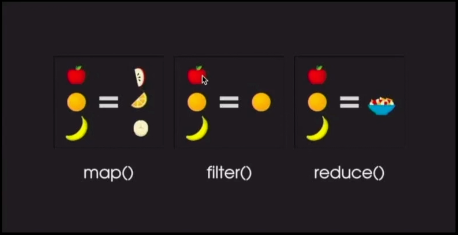

<h1 align="center"> Curso de Arrays com JS </h1>

# Curso realizado por [Thiago Zambelli][1]

<h2 align="center"> -> Assuntos abordados <- </h2>

* Realização de uma requisição para pegar todos os livros da API de exemplo;
* Entendemos o método forEach, que funciona como um for, porém passando por cada um dos elementos;
* Entendemos o método map, executando uma função para cada elemento do array e devolvendo um novo array como resultado;
* Exibimos os livros filtrados por categoria e que estejam disponíveis usando o método filter;
* Aprendemos como funciona o método de ordenação de array sort e utilizamos o mesmo para criar um filtro que ordena os livros por valor;
* Utilizamos o método reduce para descobrir o valor total de todos livros disponíveis.

[1]: https://www.linkedin.com/in/thiagozambelli "link para o Linkedin de Thiago Zambelli"